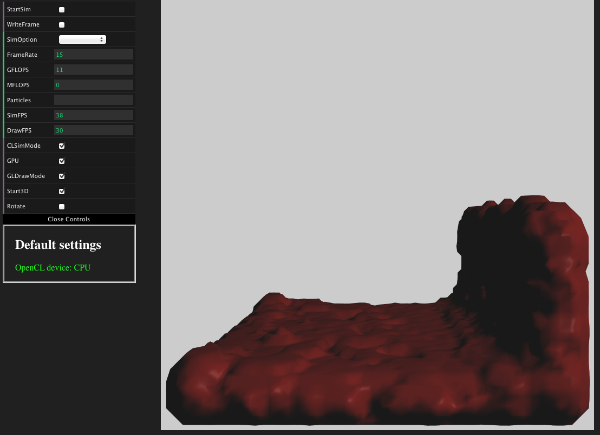

# Physical Fusion
## Physically-based modeling framework in a browser
This is a public repository of my browser based framework for physically-based modeling research. It was developed in WebGL and WebCL enabled browser.

- Tested browser
  - Safari (https://github.com/SRA-SiliconValley/webkit-webcl) : WebGL and WebCL interoperability ready.

- Current implementation
  - Smoothed particle hydrodynamics
  - WebGL + WebCL (interop) for rendering and fluid solver
  - Marching cubes for fluid surface reconstruction

- WebCL and WebGL interoperability
  - WebGL handles rendering; WebCL handles physics computation.
  
- If you find it helpful, please feel free to let me know at wang.yu@umbc.edu.
